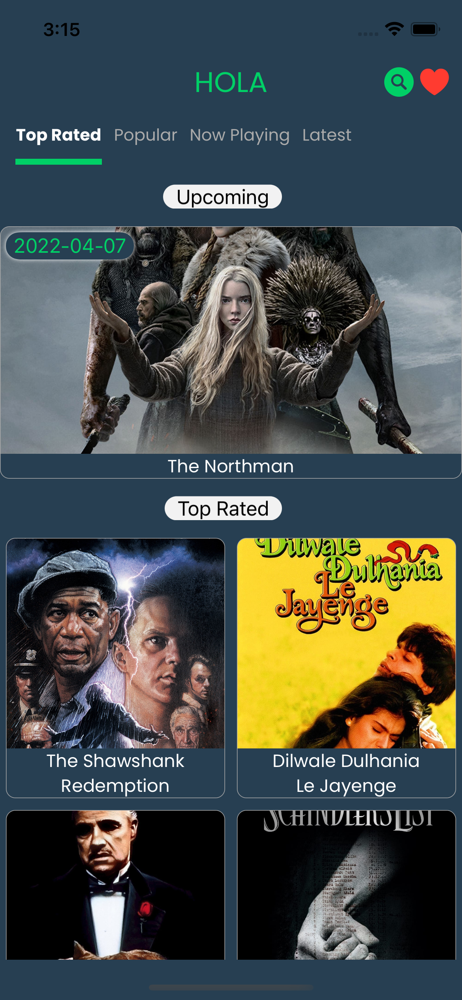
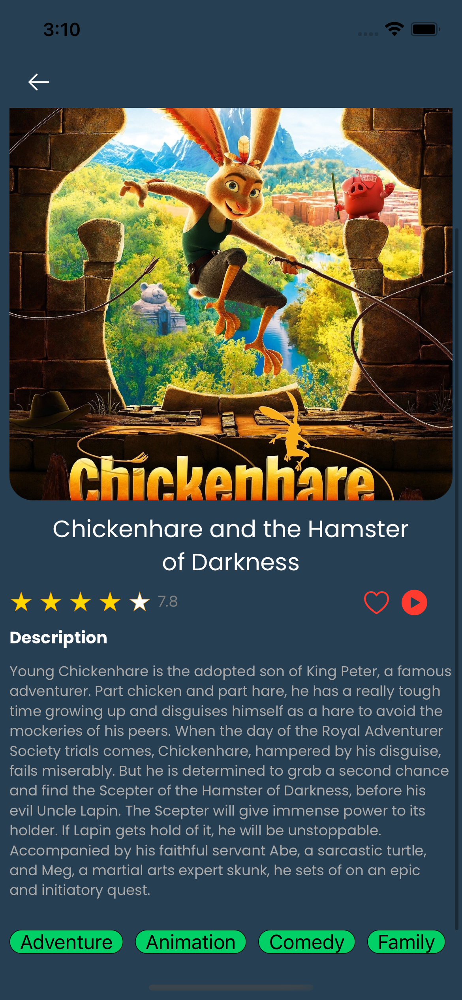
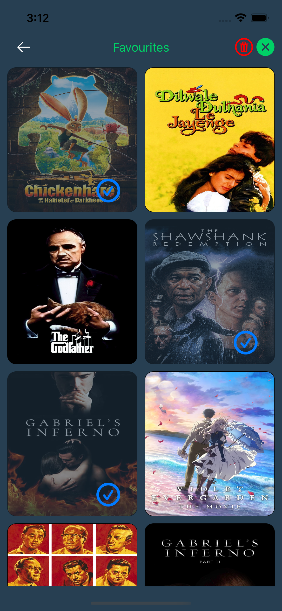
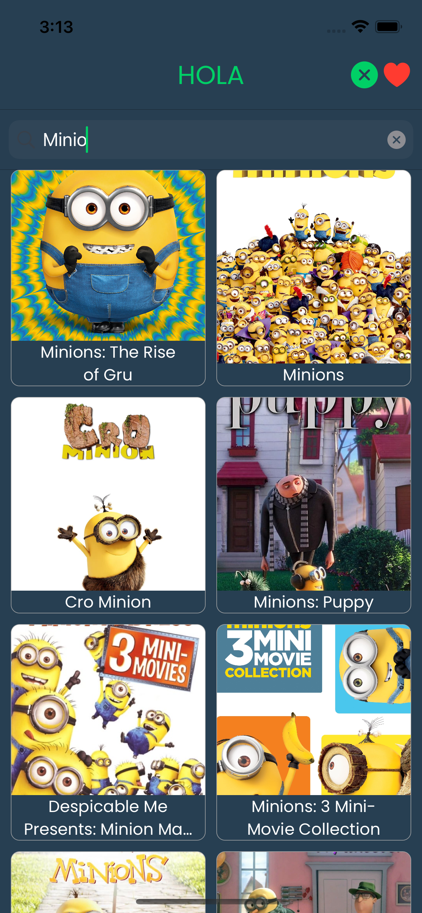

# TopMoviez
`
TopMovies is an iOS application that list top , upcoming, popular movies in a decent UI, it just make it easier for your life finding the latest and the best movies ever
`
# ScreenShots
   |     | .  |   |  | 

# Features
* it shows up a bunch of latest and updated Movies with the pagination for better performance and a very neat user interface
* it shows the details for every and each Movie item 
* it gives you the ability to search for whatever you want'
* it gives you the ability to save movies in the favourite list

# Tech
* swift 5
* POP (protocol oriented programming)
* VIPER Arch
* Core Animation
* Core Graphics

# 3<sup>rd</sup> parties libraries and tools
* Swift Package Manager(SPM)
* Moya
* Cosmos
* Lottie
* SDWebImage
* Toast-Swift
* Realm

# How To Build ?
* Clone repo
```
git clone https://github.com/Amin-0-1/TopMoviez
```
* run the project
```
open .xcworkspace
```
# Requirements
* Xcode 12.2 at least
* iOS 13+
* Swift 5
